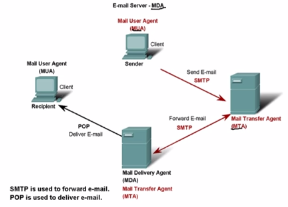

# Hacking con Python #

Guia en base a curso de hacking con python de @jdaniel conocido como Adastra en el mundo del hacking pueden encontrar el [curso gratuito aqui](http://clkmein.com/qBVMFo)

A continuación les describire un poco de las diferentes librerias mencionadas en el curso

## Socket  -basico ##

Nos permite la creación de socket's para el envio de paquetes por medio de nuestra red, los cuales deben cumplir 2 condiciones una maquina destino y una maquina origen (la nuestra).


Para más información acerca del concepto puede consultar en https://www.ecured.cu/Socket.

* Es una libreria por defecto en python para utilizarla simplemente se importa `import socket`

En el script [banner_grabbing.py](https://github.com/DGun17/Hpython/blob/master/Scripts/banner_grabbing.py) se hace uso de esta brevemente para el reconocimiento de banners con vulnerables, se preguntaran que es un banners, bueno

Cuando uno realiza un scaneo de puertos normalmente se puede apreciar algo como 


La descripción del servicio (tercera columna SERVICE), es el banner del software o servicio, por lo general mediante este se pueden identificar software con vulnerabilidades ya explotadas.


## Subprocess + ping ##


Se crea de un script para encontrar las maquinas activas en un segmento de red por medio de paquetes ICMP, utilizando el modulo mencionado.

ICMP es un protocolo simple entre el intercambio de maquinas el cual consiste enviar una peticion tipo ECHO_REQUEST a un HOST y espera un tiempo determinado la respuesta tipo ECHO_REPLY del host, pero no son los unicos mensajes que maneja este protocolo.

Por lo general se establece el funcionamiento del protocolo en la capa de enlace del modelo OSI, pero se puede apreciar su funcionamiento en comandos como PING 


Ya explicado lo mas basico del protocolo ICMP, haré referencia al modulo subprocess de python el cual permite ejecutan comando en el sistema, es decir ejecutar aplicaciónes o comandos que normalmente se ejecutan por terminal, comandos como (sistemas unix):

* ping (usado para este ejemplo)
* curl 
* nc

El script donde se usa el modulo subprocess para la utilización del comando ping lleva como nombre [basic_recon.py](https://github.com/DGun17/Hpython/blob/master/Scripts/basic_recon.py)


## DNSPython ##

Un DNS (Server Domain Name) es un servidor de nombres de dominio, el cual se encarga de procesar una dirección URL para la correcta conexión con el servidor web el cual cuenta con una dirección IP asociada a la URL.

A si mismo el proceso puede ser totalmente inverso, procesar IP's para la extracción de las URL's asociadas a estas.

Se hubican predeterminadamente en el puerto 53 manejando el protocolo UDP perteneciente a la capa 4 de transporte del modelo OSI, y para acciones como transferencias de zona, o backups utiliza el protocolo TCP en el mismo puerto 53.

Existen tipos de consultas especificas hacia los servidores de correo las que destacaremos por el momento serán

* **A** - Consultar dirección IPv4.
* **AAAA** - Consultar dirección IPv6.
* **MX** - Consultar servidor de correo.
* **NS** - Consulta de nombre de servidor.
* **TXT** - Consultar información textual.

Bueno ya explicado lo mas basico sobre un servidor DNS hablaremos de DNSPython es una libreria o modulo en python que permite realizar consultar contra registros DNS lo que indica que permite el acceso a alto nivel, pero tambien de bajo nivel al hacer manipulacion directa de zonas, mensajes, nombres o dominios.

Para mas información https://es.wikipedia.org/wiki/Sistema_de_nombres_de_dominio

Para la instlación de DNSPython se puede utilizar pip `$ pip install DNSPython`

En el siguiente script se realizan ejemplos de procesos con DNSPython

[dns_consult.py](https://github.com/DGun17/Hpython/blob/master/Scripts/dns_consult.py)


## SMTP ##

SMTP (Simple Mail Transfer Protocol), es un protocolo de tranferencia de correos el cual funciona bajo la arquitectura de Cliente-Servidor se ejecuta en la capa 7 (aplicación) del modelo OSI, por limitaciones directas del protocolo se utiliza en conjunto con los protocolos IMAP (Internet Message Access Protocol - Protocolo de acceso a mensajes de internet) y POP (Post Office Protocol - Protocolo de oficina de correo), normalmente el servicio SMTP se ejecuta en el puerto 25/TCP.

Ademas del mencionado existen otros puertos comunes en el cual se ejecutaria el protocolo

```
PORT 53 - TCP
PORT 587 - TCP (Alternativos para clientes)
PORT 465 - TCP (SMTPS)
```

Para el entendimiento del funcionamiento del protocolo SMTP hay que tener en claro 3 conceptos 

**Usados por SMTP**

**MUA** (Mail User Agent) - (Agente de Usuarios de Correo)

	* Es el encargado de la interacción con el usuario para el "mostrado" de correos electronicos y la creación de estos, un ejemplo de un MUA puede ser "Gmail, Hotmail", son aplicaciones que proveen lo anterior ya explicado.

**MTA** - Mail Transfer Agente (Agente de Transferencia de Correo)

	* Es el encargado del envio de correos (NO de su entrega) atravez de la red usando el protocolo SMTP, distribuye los mensajes en medio de los distintos servidores SMTP.

**MDA** - Mail Deliever Agent (Agente de Entrega de Correo)

	* Es agente encargado de la ENTREGA del correo enviado por SMTP, para la entrega de este hace uso del protocolo POP (Post Office Protocol).

A continuación un esquema de funcionamiento:



Gracias a estos agentes se puede llevar el proceso de entrega de correos SMTP, cabe aclarar que he explicado el funciomiento de SMTP junto con POP, no con IMAC, en este ultimo se utiliza el MSA (Mail Submission Agent) *Averiguen su funcionamiento con este, no todo se le puede dar xD*

Nada pero pueden conseguir un excelente curso de redes sobre modelo OSI y TCP/IP [AQUI](http://destyy.com/qNS6X1)

Ya explicado un poco sobre el protocolo SMTP, el protocolo cuenta con alguna serie de comandos para la verificación de usuarios en el servidor (comando vrfy), entonces si un usuario se encuentra registrado se retorna un codigo 250, sino se encuentra se retorna el codigo 550 basandonos de esto en el script se establecera una conexion SMTP y buscara la existencia de usuarios en una lista dada.

En el siguiente script se realiza la verificación de usuarios teniendo en cuenta el proceso descrito anteriomente

[stmp_single.py](https://github.com/DGun17/Hpython/blob/master/Scripts/smtp_single.py)

## SCAPY ##

Scapy es un paquete o modulo de python que permite la creación de paquetes y el envio de estos con el lenguaje de programación de este post *python*, cabe resaltar que al ser un modulo cuenta con una documentación oficial que se podra encontrar 

* https://scapy.readthedocs.io/en/latest/ 

se puede usar de 2 formas a modo de API o modo de interprete (este simplemente utilizando el comando `$ scapy`)

Además scapy soporta el estandar de filtros [BPF](https://biot.com/capstats/bpf.html) aplicable a información sobre paquetes o capturas activas.

**Nota:** para la creación de paquetes se debe especificar el tipo de protocolo a usar en cada una de las capas del modelo TCP/IP comenzando por supuesto desde la primera hasta la 5 separadas por un **/** ejemplo

packet = Ether[]/IP[dest= "google.com"]/ICMP[]/"ABCD"

Se realizo la creación del paquete tipo ICMP declarando la información de las capas 

**Aplicacion** :  "ABCD", su PDU se denomina DATA
**Transporte** : IP, su PDU en este caso se denomina SEGMENTO por el uso de TCP
**Red** : ICMP, su PDU se denomina PAQUETE
**Enlace** : Ether, su PDU se denomina FRAME (en esta se asigna un tipo de HEADER dependiendo del medio).

Algunas funciones interesantes del modulo scapy son 

**ls** - Permite listar todos los protocolos disponibles a usar por el modulo.

**lsc** - Permite listar todas las acciones (funciones) disponibles.

Si se utiliza la funcion ls y en sus argumentos se instancia un paquete creado se podra apreciar la información de este, es decir si consultamos `$ ls(packet)` se enlistara la información del paquete.

**sendp** - Permite enviar un paquete ya "formado", ejemplo `$ sendp(packet)`.

si ademas del paquete se puede establecer los atributos

*loop* - Establece la cantidad de veces que se enviara el paquete.

*inter* - Establece el tiempo de espera entre envios de paquetes.

**sr1** - Permite enviar un paquete y recibir una respuesta por ello.

Exite una variable especial "_" que hace referencia a el ultimo paquete recibido y todas las funcionas "invocadas" a esta variable mostrata la información respecto al paquete recibido.

**show** - Permite mostrar la información de un paquete recibido.

**summary** - Muestra la información de un paquete recibido de forma simple.

**sniff** - Permite la captura de paquetes, algunos atributos que se pueden destacar son

*iface* - Establece la interfaz a realizar sniffing.
*count* - Establece un numero limite de paquetes a capturar.
*prn* - Permite la ejecución de funciones al momento de capturar un paquete.
*filter* - Permite aplicar filtros en formato BPF.

**wrpcap** - Permite guardar en un archivo .pcap información de paquetes su estructura basica es `wrpcap("archivo.pcap", <variable con ifnormación de paquetes>)`.

**rdpcap** - Permite leer un fichero .pcap.


